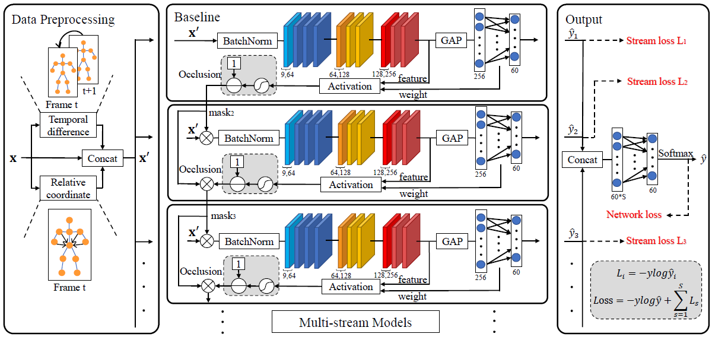
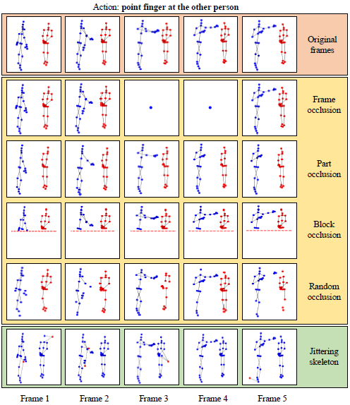

# Richly Activated Graph Convolutional Network (RA-GCN) v2.0

## 1 Paper Details

Yi-Fan Song, Zhang Zhang, Caifeng Shan and Liang Wang. **Richly Activated Graph Convolutional Network for Robust Skeleton-based Action Recognition.** IEEE Transaction on Circuits and Systems for Video Technology, 2020. [[IEEE TCSVT 2020]](https://ieeexplore.ieee.org/document/9162143) [[Arxiv Preprint]](https://arxiv.org/pdf/2008.03791.pdf)

Previous version (RA-GCN v1.0): [[Github]](https://github.com/yfsong0709/RA-GCNv1) [[IEEE ICIP 2019]](https://ieeexplore.ieee.org/document/8802917) [[Arxiv Preprint]](https://arxiv.org/pdf/1905.06774.pdf)

The following picture is the pipeline of RA-GCN v2.
<div align="center">
    
</div>

The occlusion and jittering skeleton samples are illustrated by
<div align="center">
    
</div>


## 2 Prerequisites

### 2.1 Libraries

This code is based on [Python3](https://www.anaconda.com/) (anaconda, >=3.5) and [PyTorch](http://pytorch.org/) (>=0.4.0 and <=1.2.0).

**Note:** nn.ParameterList may report an error when using more than one GPU in higher PyTorch version.

Other Python libraries are presented in the **'requirements.txt'**, which can be installed by 
```
pip install -r requirements.txt
```

### 2.2 Experimental Dataset

Our models are experimented on the **NTU RGB+D 60 & 120** datasets, which can be download from 
[here](http://rose1.ntu.edu.sg/datasets/actionrecognition.asp).

There are 302 samples of **NTU RGB+D 60** need to be ignored, which are shown in the **datasets/ignore60.txt**, and 532 samples of **NTU RGB+D 120**, shown in the **datasets/ignore120.txt**.

### 2.3 Pretrained Models

Several pretrained models are provided, which include **baseline**, **2-stream RA-GCN** and **3-stream RA-GCN** for the **cross-subject (CS)** and **cross-view (CV)** benchmarks of the **NTU RGB+D 60** dataset and the **cross-subject (CSub)** and **cross-setup (CSet)** benchmarks of the **NTU RGB+D 120** dataset. The baseline model also means 1-stream RA-GCN.

These models can be downloaded from [BaiduYun](https://pan.baidu.com/s/1zrNPGD5eqo2dK00k8fFh1Q) (Extract code: s9kt) or 
[GoogleDrive](https://drive.google.com/drive/folders/1R4db_OWhIKqlt_CN9fwupX9LAFKZeZwP?usp=sharing).

You should put these models into the **'models'** folder.


## 3 Parameters

Before training and evaluating, there are some parameters should be noticed.

* (1) **'--config'** or **'-c'**: The config of RA-GCN. You must use this parameter in the command line or the program will output an error. There are 8 configs given in the **configs** folder, which can be illustrated in the following tabel.

| config    | 2001      | 2002      | 2003      | 2004      | 2101      | 2102      | 2103      | 2104      |
| :-------: | :-------: | :-------: | :-------: | :-------: | :-------: | :-------: | :-------: | :-------: |
| model     | 2s RA-GCN | 3s RA-GCN | 2s RA-GCN | 3s RA-GCN | 2s RA-GCN | 3s RA-GCN | 2s RA-GCN | 3s RA-GCN |
| benchmark | CS        | CS        | CV        | CV        | CSub      | CSub      | CSet      | CSet      |

* (3) **'--resume'** or **'-r'**: Resume from checkpoint. If you want to start training from a saved checkpoint in the **'models'** folder, you can add this parameter to the command line.

* (4) **'--evaluate'** or **'-e'**: Only evaluate trained models. For evaluating, you should add this parameter to the command line. The evaluating model will be seleted by the **'--config'** parameter.

* (5) **'--extract'** or **'-ex'**: Extract features from a trained model for visualization. 
Using this parameter will make a data file named **'visualize.npz'** at the current folder.

* (6) **'--visualization'** or **'-v'**: Show the information and details of a trained model. 
You should extract features by using **'--extract'** parameter before visualizing.

Other parameters can be updated by modifying the corresponding config file in the **'configs'** folder or using command line to send parameters to the model, and the parameter priority is **command line > yaml config > default value**.


## 4 Running

### 4.1 Generate Datasets

Before training or testing our model, please generate datasets first by using **'gen_data.py'** in the current folder.

In this file, two parameters are required to modify, which are **'folder1'** and **'folder2'**. You should change them to your path to **NTU RGB+D** datasets, e.g., `/data1/yifan.song/NTU_RGBD/nturgbd_skeletons_s001_to_s017/` for **NTU RGB+D 60** and `/data1/yifan.song/NTU_RGBD/nturgbd_skeletons_s018_to_s032/` for **NTU RGB+D 120**.

Then, you can generate datasets by
```
python gen_data.py
```
and the results are saved in **'datasets'** folder.

### 4.2 Train

You can simply train the model by 
```
python main.py -c <config>
```
where `<config>` is the config file name in the **'configs'** folder, e.g., 2001.

If you want to restart training from the saved checkpoint last time, you can run
```
python main.py -c <config> -r
```

### 4.3 Evaluate

Before evaluating, you should ensure the trained model corresponding the config are already saved in the **'models'** folder. Then run
```
python main.py -c <config> -e
```

### 4.4 Occlusion and Jittering

Before occlusion and jittering experiments, you should ensure the trained model corresponding the config are already saved in the **'models'** folder. Then run
```
python main.py -c <config> -e -op <occlusion_part>
(or)
python main.py -c <config> -e -jj <jittering_prob> --sigma <noise_variance>
```
where `<occlusion_part>` denotes the occluded part (choices, [1,2,3,4,5] means left arm, right arm, two hands, two legs and trunk, respectively), `<jittering_prob>` denotes the probablity of jittering (choices, [0.02,0.04,0.06,0.08,0.10]), and `<noise_variance>` (choices, [0.05,0.1]) denotes the variance of noises.

### 4.5 Visualization

To visualize the details of the trained model, you can run
```
python main.py -c <config> -ex -v
```
where **'-ex'** can be removed if the data file **'visualize.npz'** already exists in the current folder.


## 5 Results

### 5.1 Top-1 Accuracy

Top-1 Accuracy for the provided models on **NTU RGB+D 60 & 120** datasets.

| models   | 3s RA-GCN | 2s RA-GCN | baseline | version 1.0 |
| :------: | :-------: | :-------: | :------: | :---------: |
| NTU CS   | 87.3%     | 86.7%     | 85.8%    | 85.9%       |
| NTU CV   | 93.6%     | 93.4%     | 93.1%    | 93.5%       |
| NTU CSub | 81.1%     | 81.0%     | 78.2%    | 74.4%       |
| NTU CVet | 82.7%     | 82.5%     | 80.0%    | 79.4%       |

### 5.2 Occlusion and Jittering Experiments

These results are presented in the paper.


## 6 Citation and Contact

If you have any question, please send e-mail to `yifan.song@cripac.ia.ac.cn`.

Please cite our paper when you use this code in your reseach.
```
@InProceedings{song2019richly,
  title        = {RICHLY ACTIVATED GRAPH CONVOLUTIONAL NETWORK FOR ACTION RECOGNITION WITH INCOMPLETE SKELETONS},
  author       = {Yi-Fan Song and Zhang Zhang and Liang Wang},
  booktitle    = {International Conference on Image Processing (ICIP)},
  organization = {IEEE},
  year         = {2019},
}

@InProceedings{song2020richly,
  title        = {Richly Activated Graph Convolutional Network for Robust Skeleton-based Action Recognition},
  author       = {Yi-Fan Song and Zhang Zhang and Caifeng Shan and Liang Wang},
  booktitle    = {IEEE Transaction on Circuits and Systems for Video Technology (TCSVT)},
  organization = {IEEE},
  year         = {2020},
}
```
